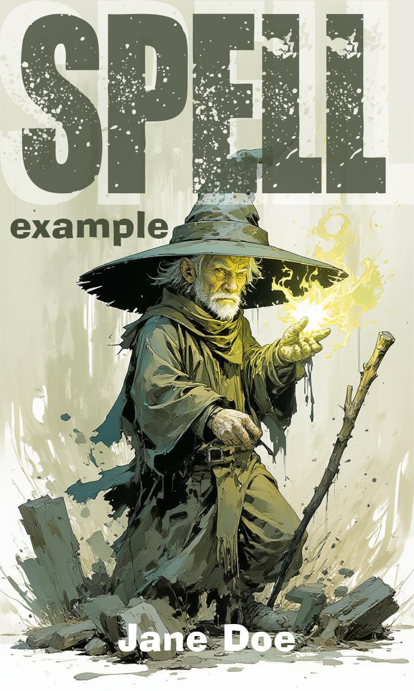

$[title](Spell Example Book)
$[author](Jane Doe)
$[language](EN)
$[uuid](18b04cfb-6d81-405f-833f-aa5182212bbb)
$[series](Spell Demos)
$[date](2026-06-25)
$[rights](© 2026 Jane Doe. All rights reserved.)
$[source](https://github.com/behringer24/spell)
$[relation](https://github.com/behringer24/spell/wiki)
$[type](Text)
$[entry](1)
$[quotes](&raquo;,&laquo;,&rsaquo;,&lsaquo;)

%toc(Contents)

%index[Inventions](Index of Inventions)

%index[Persons](Index of Notable Figures)

